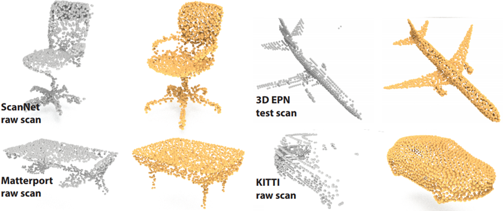

### Unpaired Point Cloud Completion on Real Scans using Adversarial Training

Implementation of ICLR 2020 paper <a href="https://arxiv.org/abs/1904.00069" target="_blank">(link)</a>.



### Dependencies
The code is tested with Python 3.5, TensorFlow 1.5, CUDA 9.0 on Ubuntu. 

### Installation
#### Compile Customized TF Operators from PointNet2
Instructions can be found from <a href="https://github.com/charlesq34/pointnet2" target="_blank">PointNet2</a>.
#### Compile the EMD/Chamfer losses (CUDA implementations from <a href="https://github.com/charlesq34/pointnet2" target="_blank">Fan et al.</a>)
    cd pcl2pcl-gan-pub/pc2pc/structural_losses_utils
    # with your editor, modify the paths in the makefile
    make

### Data
For convenience, we provide our synthetic clean and complete point clouds, and point representation data of 3D-EPN, download <a href="https://pan.baidu.com/s/1jDJJ6RjRpuXpu5GSJcPQmg" target="_blank">data with code: npaj</a>.
After download is finished, unzip the zip file, put it under pcl2pcl-gan-pub/pc2pc/data

### Train
For training for a specific class (before that, cd pcl2pcl-gan-pub/pc2pc):
1. train clean and complete AE:
    CUDA_VISIBLE_DEVICES=0 python3 train_ae_ShapeNet-v1.py

2. train GAN:
    CUDA_VISIBLE_DEVICES=0 python3 train_pcl2pcl_gan_3D-EPN.py

## Citation
```
@inproceedings{chen2020pcl2pcl,
  title={Unpaired Point Cloud Completion on Real Scans using Adversarial Training},
  author={Chen, Xuelin and Chen, Baoquan and Mitra, Niloy J},
  booktitle={Proceedings of the International Conference on Learning Representations (ICLR)},
  year={2020}
}
```
